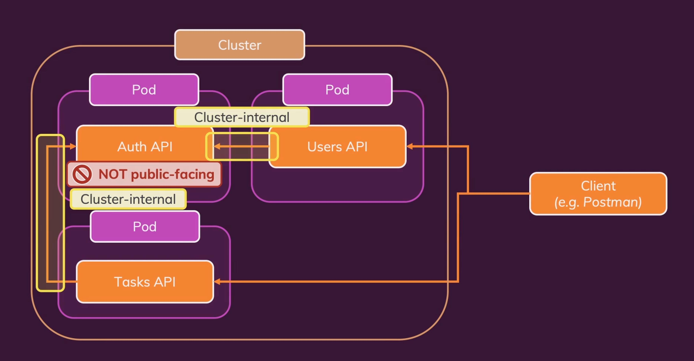
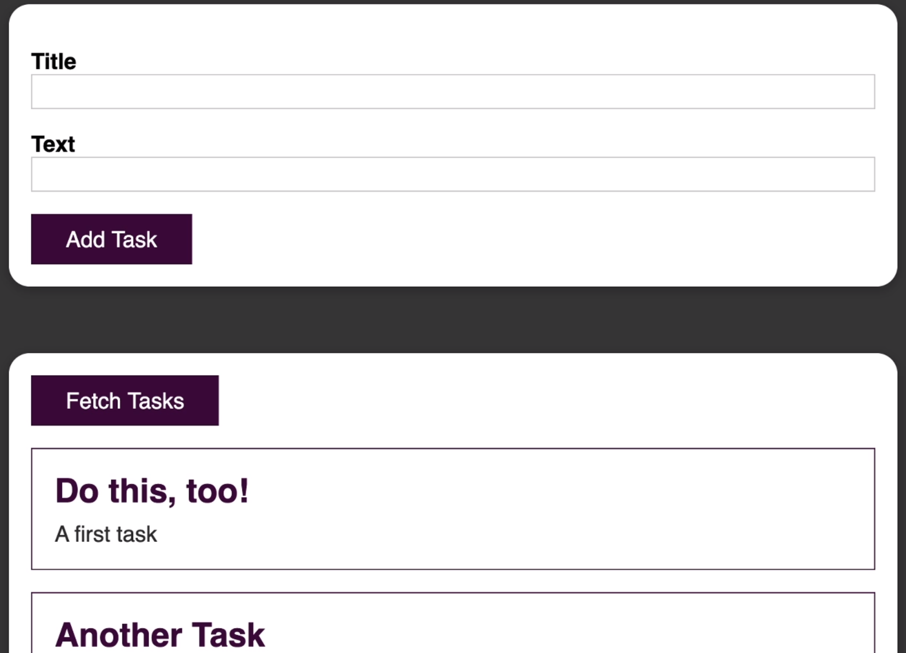

# Kubernetes To-Do App

This repository contains instructions of how to run a simple to-do app made in react/express developed with the goal of training the usage of kubernetes.
This application is made with the help of [Docker & Kubernetes: The Practical Guide](https://www.udemy.com/course/docker-kubernetes-the-practical-guide/).

## Prerequisites

I have used [minikube](https://kubernetes.io/docs/getting-started-guides/minikube/) to run a local Kubernetes instance. We will access this local Kubernetes with the client called `kubectl`.

* Install [minikube](https://github.com/kubernetes/minikube/releases)
* Install [kubectl](https://kubernetes.io/docs/user-guide/prereqs/)

Verify your installation:

```
$ minikube version
minikube version: v0.16.0

$ minikube start

$ kubectl version
Client Version: version.Info{Major:"1", Minor:"5", GitVersion:"v1.5.2", GitCommit:"08e099554f3c31f6e6f07b448ab3ed78d0520507", GitTreeState:"clean", BuildDate:"2017-01-12T04:57:25Z", GoVersion:"go1.7.4", Compiler:"gc", Platform:"darwin/amd64"}
Server Version: version.Info{Major:"1", Minor:"5", GitVersion:"v1.5.2", GitCommit:"08e099554f3c31f6e6f07b448ab3ed78d0520507", GitTreeState:"clean", BuildDate:"1970-01-01T00:00:00Z", GoVersion:"go1.7.1", Compiler:"gc", Platform:"linux/amd64"}
```

## How to run

Start [minikube](https://kubernetes.io/docs/getting-started-guides/minikube/) running:
* minikube start --driver=$DRIVER          -$DRIVER example: docker

We can see if minikube starts successfully with:
* minikube status

Then we need to build all yaml files inside kubernetes folder
* kubectl apply -f kubernetes

We can see all the pods running with the command
* kubectl get pods

We can get the frontend url running
* minikube service frontend-service --url


## DEMO

 



